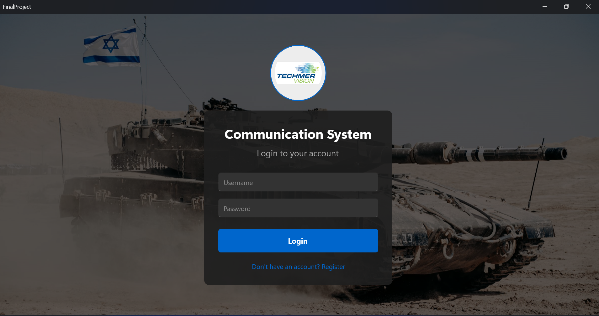
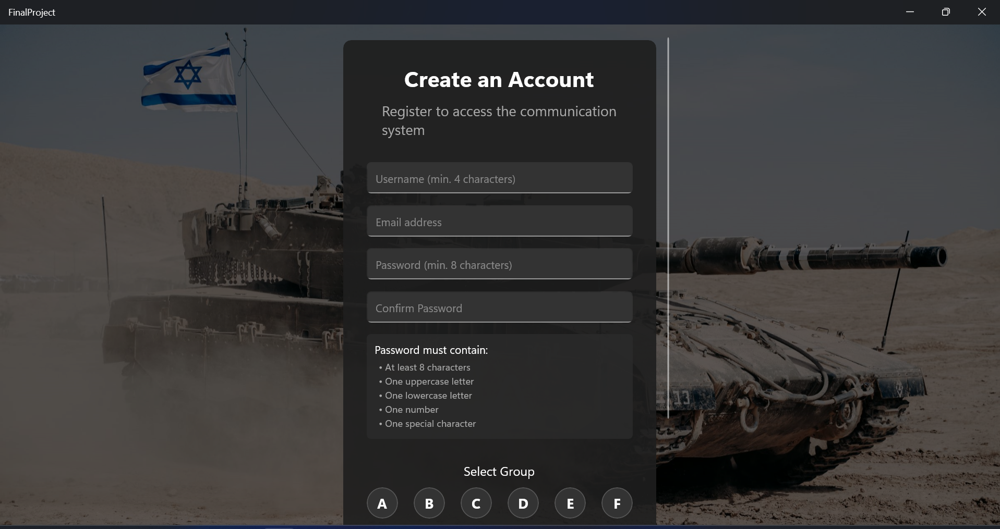
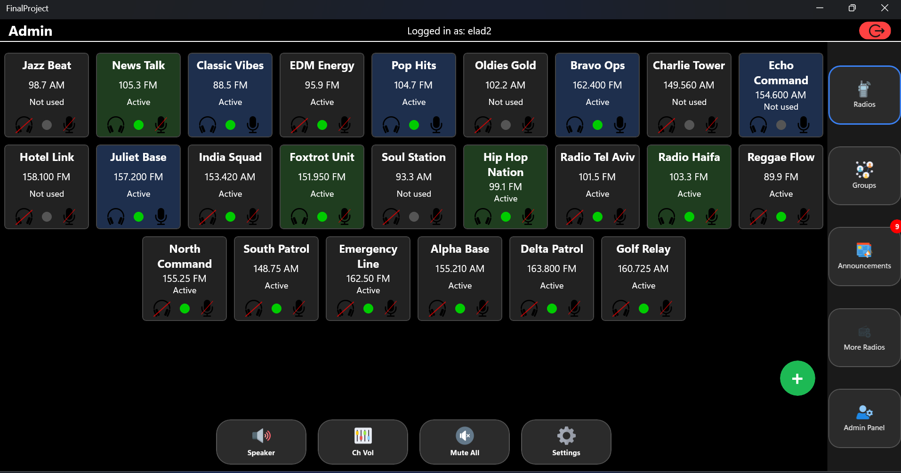
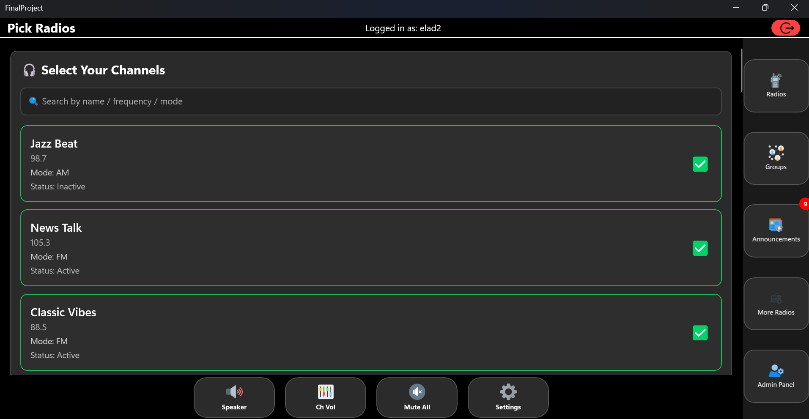
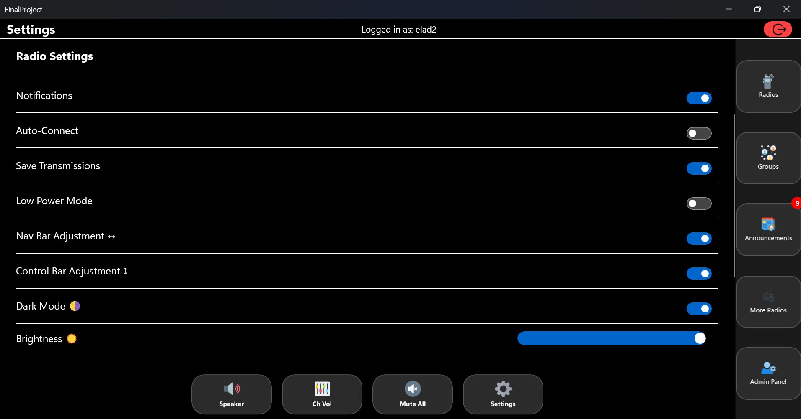
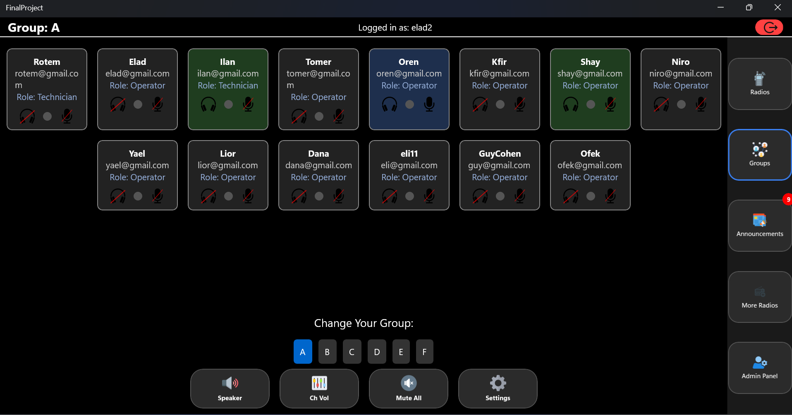
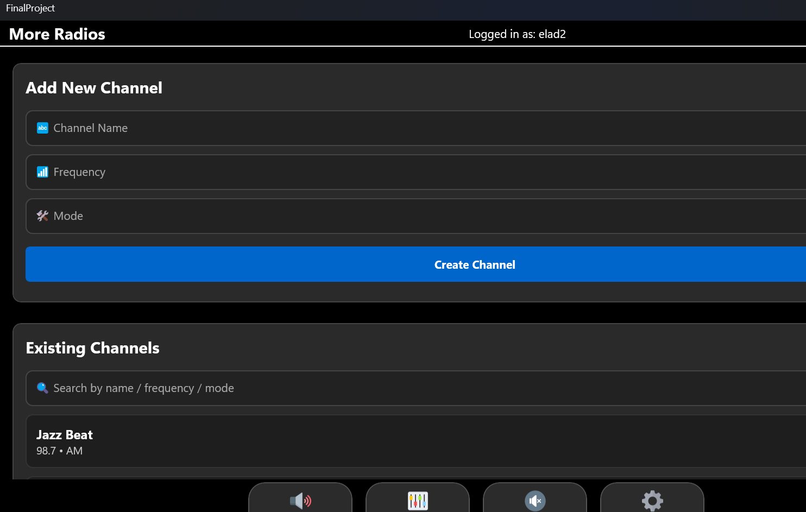
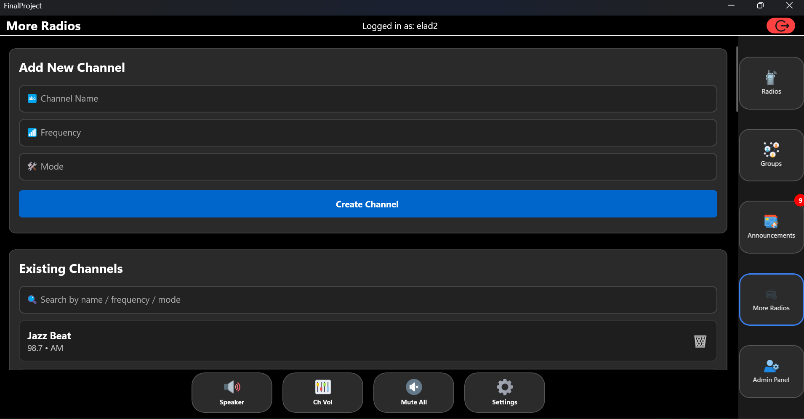

# Communication System Interface

## Overview
This project is a secure and user-friendly communication system developed as a final academic project in collaboration with a defense company. Designed to operate in classified and sensitive environments, the system focuses on both security and usability. It provides real-time communication capabilities for personnel via a robust and intuitive interface, optimized for both performance and operational needs.

## Project Timeline
**Duration:** October 2024 – Present

## Key Features
- **Secure User Authentication**: Supports login and registration flows with validation rules.
- **Channel-Based Communication**: Users can choose, activate, or mute multiple communication channels.
- **User Roles**: Includes role-based access for Operators, Technicians, and Admins.
- **Real-Time Announcements**: Admins can post live updates and system tips.
- **Custom Settings**: Toggle dark mode, save transmissions, control power/brightness levels, and more.
- **Dynamic Channel Management**: Create, update, and delete radio channels from within the interface.

## Technologies Used
- **Frontend**: React & React Native
- **API Communication**: REST API
- **Communication Protocol**: Protocol Buffers (Protobuf), custom network protocols
- **Platform**: Migrated from Linux to Windows for improved compatibility and deployment

## Skills Demonstrated
- Software Architecture & Component Design
- React UI/UX Design
- Authentication & Role Management
- Protocol Design with Protobuf
- Cross-Platform Optimization
- Secure Programming Practices

## Screenshots

### 1. Login Interface

### 2. Registration Interface

### 3. Admin Main Panel

### 4. Pick Radios

### 5. Settings Page

### 6. Add Radios

### 7. User Management

### 8. Announcements Panel

## Credits
Developed by Elad Aharon as part of the final year project in partnership with a defense technology company.

---

> For demonstration purposes only. The system shown is part of a simulated communication environment.
