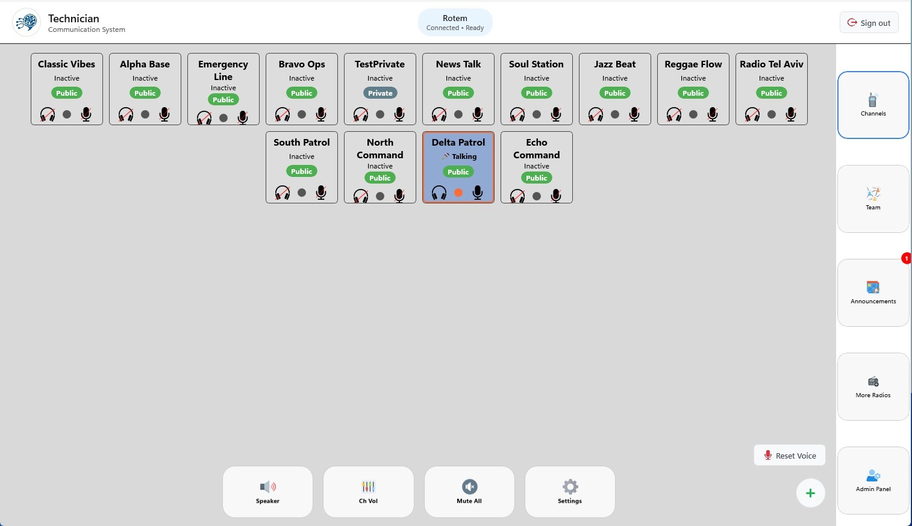

# 🎤 IronWave - Enterprise Communication Platform

[](https://reactnative.dev/)
[](https://dotnet.microsoft.com/)
[](https://www.microsoft.com/windows)
[](LICENSE)

A sophisticated, real-time communication platform built with **React Native for Windows** and **ASP.NET Core**, featuring enterprise-grade voice communication, radio channel management, private calling, and comprehensive administrative controls. This project demonstrates advanced full-stack development skills with native integration, real-time communication protocols, and production-ready features.

## 🎯 Project Overview

IronWave is a comprehensive communication system designed for organizations requiring secure, real-time voice communication with role-based access control. The platform combines modern web technologies with native Windows integration to deliver a seamless communication experience.

### 🌟 Key Features

- **🎤 Real-time Voice Communication** - Powered by Agora SDK with native C++ integration
- **📻 Multi-channel Radio System** - PIN-protected channels with SHA256 encryption
- **📞 Private Calling System** - One-to-one calls with invitation management
- **👥 Role-based Access Control** - Admin, Technician, Operator roles
- **📢 Real-time Announcements** - With read/unread tracking
- **🛡️ Enterprise Security** - Session management & input validation
- **🎨 Modern UI/UX** - Fluent Design with Dark/Light mode
- **📱 Responsive Design** - Optimized for Windows desktop

## 🏗️ Architecture

### Frontend Architecture (React Native for Windows)

```
ClientSide/
├── src/
│   ├── components/          # Reusable UI components
│   ├── screens/            # Application screens
│   ├── context/            # React Context for state management
│   ├── utils/              # Utility functions & API services
│   └── navigation/         # Navigation configuration
├── windows/                # Native Windows integration
│   └── FinalProject/
│       └── AgoraModule/    # Custom C++ Agora integration
└── assets/                 # Images, fonts, and static resources
```

### Backend Architecture (ASP.NET Core 6.0)

```
ServerSide/CommunicationServer/
├── Controllers/            # REST API endpoints
├── BL/                     # Business Logic models
├── DAL/                    # Data Access Layer
├── Properties/             # Application configuration
└── Program.cs              # Application entry point
```

## 🛠️ Technology Stack

### Frontend Technologies
- **React Native 0.78.0** - Cross-platform mobile framework
- **React Native for Windows** - Windows-specific implementation
- **Fluent UI** - Microsoft's design system
- **React Navigation 7.x** - Screen navigation and routing
- **Context API** - State management
- **Axios** - HTTP client for API communication
- **Agora SDK** - Real-time voice communication

### Backend Technologies
- **ASP.NET Core 6.0** - Modern web API framework
- **SQL Server** - Enterprise database with stored procedures
- **Entity Framework** - Object-relational mapping
- **Swagger/OpenAPI** - API documentation and testing
- **CORS** - Cross-origin resource sharing

### Native Integration
- **Custom C++ Module** - Agora SDK integration for Windows
- **React Native Bridge** - C++ to JavaScript communication
- **Real-time Audio Processing** - Noise suppression and echo cancellation
- **Native Windows Audio** - Direct audio system integration

## 🚀 Core Features

### 📻 Radio Channel Management
- **Multi-channel Support** - Unlimited radio channels
- **PIN Protection** - SHA256 encrypted channel access
- **Channel States** - Idle, ListenOnly, ListenAndTalk
- **Real-time Participants** - Live user tracking
- **Public/Private Modes** - Flexible channel configuration

### 🎤 Voice Communication
- **Agora-powered Voice** - Industry-leading voice quality
- **AI Noise Suppression** - Crystal-clear audio
- **Volume Control** - Dynamic audio level adjustment
- **Microphone Controls** - Mute/unmute functionality
- **Real-time Audio Processing** - Low-latency communication

### 📞 Private Calling System
- **One-to-one Calls** - Direct user communication
- **Call Invitations** - Accept/reject functionality
- **Real-time Status** - Live call state tracking
- **Group Discovery** - User search by groups
- **Call Duration** - Time tracking and logging

### 👥 User Management & Authentication
- **Role-based Access** - Admin, Technician, Operator
- **Group Assignments** - Organizational structure
- **User Blocking** - Security controls
- **Session Management** - Secure login/logout
- **Password Security** - Encrypted authentication

### 📢 Announcements System
- **Real-time Notifications** - Instant message delivery
- **Role-based Posting** - Controlled content creation
- **Read/Unread Tracking** - Message status monitoring
- **Priority System** - Important message highlighting

### 🛠️ Administrative Features
- **User Management Dashboard** - Comprehensive user control
- **Role Management** - Permission assignment
- **System-wide Controls** - Global settings
- **User Analytics** - Usage tracking and reporting
- **Security Monitoring** - Access log tracking

## 🔒 Security Features

- **PIN-based Channel Access** - Cryptographic hashing
- **Session Management** - Multiple login prevention
- **Input Validation** - XSS and injection protection
- **Role-based Permissions** - Granular access control
- **CORS Configuration** - Secure cross-origin requests
- **SQL Injection Prevention** - Parameterized queries

## 📱 Screenshots

### Authentication & Main Interface

*Modern authentication interface with secure login*


*User account creation with comprehensive validation*


*Radio channel management with real-time status indicators*


*Application in light mode with clean, modern design*

### Communication Features

*Team page with user discovery and private calling*


*Incoming call interface with accept/reject options*


*Call waiting interface while recipient responds*


*Channel selection interface for radio management*


*Extended channel management with additional options*

### Administrative Tools

*Comprehensive user management dashboard*


*System configuration and user preferences*


*Real-time announcements system with read/unread tracking*

### Additional Screenshots


### Legacy Screenshots (JPG Format)



## 🎯 Use Cases

This enterprise communication system is ideal for:

- **🚨 Emergency Services** - First responders and crisis management
- **🛡️ Security Teams** - Law enforcement and private security
- **🏭 Industrial Communication** - Manufacturing and logistics
- **🏢 Corporate Platforms** - Business communication systems
- **🎪 Event Management** - Large-scale event coordination
- **🏥 Healthcare** - Medical team communication
- **🏫 Educational Institutions** - Campus-wide communication

## 🚀 Getting Started

### Prerequisites
- Windows 10/11
- Node.js 18+
- .NET 6.0 SDK
- SQL Server 2019+
- Visual Studio 2022 (for native development)

### Installation

1. **Clone the repository**
   ```bash
   git clone https://github.com/yourusername/ironwave.git
   cd ironwave
   ```

2. **Backend Setup**
   ```bash
   cd ServerSide/CommunicationServer
   dotnet restore
   dotnet run
   ```

3. **Frontend Setup**
   ```bash
   cd ClientSide
   npm install
   npm run windows
   ```

### Configuration
- Update database connection string in `appsettings.json`
- Configure Agora SDK credentials
- Set up CORS policies for production

## 🧪 Testing

- **API Testing** - Swagger UI at `/swagger`
- **Unit Tests** - Jest for frontend, xUnit for backend
- **Integration Tests** - End-to-end communication testing
- **Performance Testing** - Load testing for voice channels

## 📊 Performance Metrics

- **Voice Latency** - < 100ms end-to-end
- **Channel Capacity** - 100+ concurrent users
- **API Response Time** - < 50ms average
- **Memory Usage** - Optimized for Windows desktop
- **CPU Utilization** - Efficient audio processing

## 🤝 Contributing

1. Fork the repository
2. Create a feature branch (`git checkout -b feature/AmazingFeature`)
3. Commit your changes (`git commit -m 'Add some AmazingFeature'`)
4. Push to the branch (`git push origin feature/AmazingFeature`)
5. Open a Pull Request

## 📄 License

This project is licensed under the MIT License - see the [LICENSE](LICENSE) file for details.

## 👨‍💻 Author

**Elad Aharon** - Full Stack Developer
- GitHub: [@Elad60](https://github.com/Elad60)
- LinkedIn: [Elad LinkedIn](https://linkedin.com/in/elad-ah)

**Rotem Rosenberg** - Full Stack Developer
- GitHub: [@RotemRosenberg](https://github.com/RotemRosenberg)
- LinkedIn: [Rotem LinkedIn](www.linkedin.com/in/rotemrosenberg)

## 🙏 Acknowledgments

- **Agora.io** - Real-time communication SDK
- **Microsoft** - React Native for Windows
- **Fluent UI** - Design system components
- **React Native Community** - Windows platform support

---

⭐ **Star this repository if you find it helpful!**
